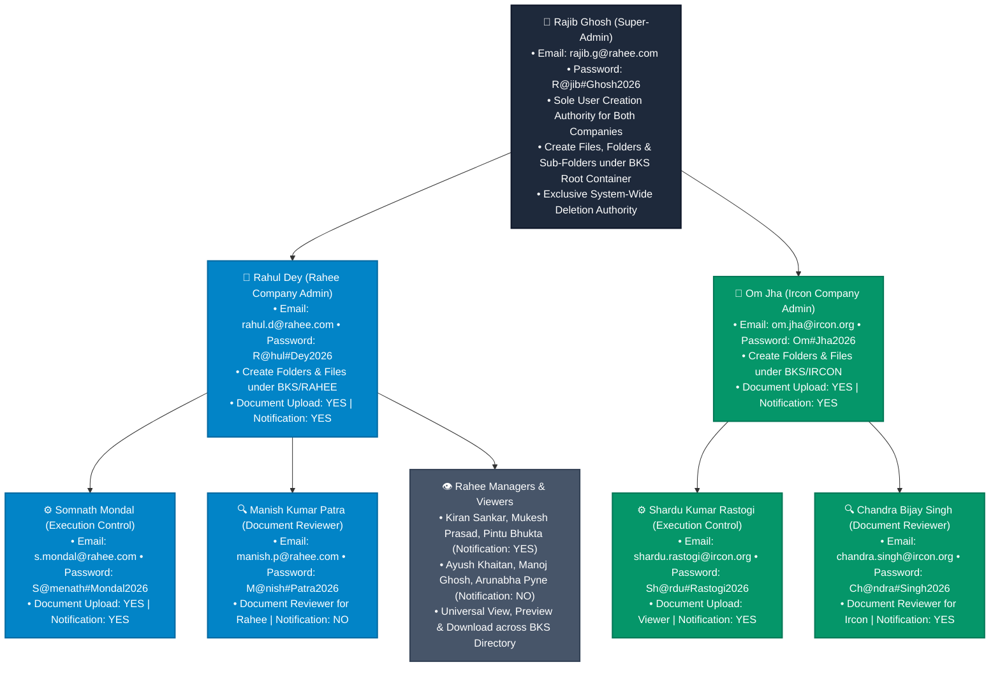

# 📁 Enterprise Document Management System (EDMS)
## Master System Specification & User Directory

This document serves as the official master specification for the **Enterprise Document Management System (EDMS)**, incorporating all user credentials, operational roles, folder creation boundaries, upload permissions, notification settings, and core technical policies across **Rahee Infratech Limited**, **Ircon International Limited**, and the **Global Super-Admin**.

---

## 📐 1. System Governance & Access Flowchart

---

## 🔑 2. Global Super-Admin Authority & Specifications

| Parameter | Master Technical Specification |
| :--- | :--- |
| **User Name** | **Rajib Ghosh** |
| **Registered Email (User ID)** | `rajib.g@rahee.com` |
| **System Password** | `R@jib#Ghosh2026` |

| **System Role** | **Global Super-Admin** |
| **Organization Scope** | System-Wide (Both Rahee Infratech Limited & Ircon International Limited) |
| **User Creation Authority** | **SOLE AUTHORITY:** Super-Admin Rajib Ghosh is strictly responsible for creating user accounts for both companies in the system. |
| **Folder & Sub-folder Scope** | **Root BKS Folder Directory:** Full authority to create top-level folders, sub-folders, and directory branches under the **`BKS`** root container and system-wide. |
| **File & Document Creation** | **FULL AUTHORITY:** Authority to upload, attach, and create project files (Word, PDF, Excel, PowerPoint, Images, AutoCAD) under **`BKS`** root or any sub-folder. |
| **Deletion Authority** | **EXCLUSIVE AUTHORITY:** File and folder deletion is strictly restricted to Super-Admin Rajib Ghosh ONLY (all other users blocked with HTTP `403 Forbidden`). |
| **System Governance** | Account status management (Active / Disabled), account lockout releases (15-min lockout after 5 failed attempts), JWT token security, and real-time audit trail logs. |

---

## 🏢 3. Rahee Infratech Limited — Official User Specifications

| Name | Email ID | Password | Function (Role) | Notification in Document Upload | Document Upload & Viewer | Document Preview & Download | Supported Document Types |
| :--- | :--- | :--- | :--- | :---: | :---: | :---: | :--- |
| **Rahul Dey** | `rahul.d@rahee.com` | `R@hul#Dey2026` | **Admin** | **Yes** | **Upload** | Preview and download | Microsoft Word, PDF, Microsoft Excel, Microsoft PowerPoint, Images, Auto Cad |
| **Manish Kumar Patra** | `manish.p@rahee.com` | `M@nish#Patra2026` | **Document Reviewer** | No | **Viewer** | Preview and download | Microsoft Word, PDF, Microsoft Excel, Microsoft PowerPoint, Images, Auto Cad |
| **Kiran Sankar Chowdhury** | `kiransankar.c@rahee.com` | `K1ran#Sankar2026` | **Manager** | **Yes** | **Viewer** | Preview and download | Microsoft Word, PDF, Microsoft Excel, Microsoft PowerPoint, Images, Auto Cad |
| **Mukesh Kumar Prasad** | `mukesh.p@rahee.com` | `M@kesh#Prasad2026` | **Manager** | **Yes** | **Viewer** | Preview and download | Microsoft Word, PDF, Microsoft Excel, Microsoft PowerPoint, Images, Auto Cad |
| **Pintu Bhukta** | `pintu.b@rahee.com` | `P1ntu#Bhukta2026` | **Manager** | **Yes** | **Viewer** | Preview and download | Microsoft Word, PDF, Microsoft Excel, Microsoft PowerPoint, Images, Auto Cad |
| **Somnath Mondal** | `s.mondal@rahee.com` | `S@menath#Mondal2026` | **Execution Control** | **Yes** | **Upload** | Preview and download | Microsoft Word, PDF, Microsoft Excel, Microsoft PowerPoint, Images, Auto Cad |
| **Ayush Khaitan** | `ayush.k@rahee.com` | `Ayu$h#Khaitan2026` | **Manager** | No | **Viewer** | Preview and download | Microsoft Word, PDF, Microsoft Excel, Microsoft PowerPoint, Images, Auto Cad |
| **Manoj Ghosh** | `manoj.g@rahee.com` | `M@noj#Ghosh2026` | **Manager** | No | **Viewer** | Preview and download | Microsoft Word, PDF, Microsoft Excel, Microsoft PowerPoint, Images, Auto Cad |
| **Arunabha Pyne** | `arunabha.p@rahee.com` | `Arun#Pyne2026` | **Manager** | No | **Viewer** | Preview and download | Microsoft Word, PDF, Microsoft Excel, Microsoft PowerPoint, Images, Auto Cad |

---

## 🏛️ 4. Ircon International Limited — Official User Specifications

| Name | Email ID | Password | Function (Role) | Notification in Document Upload | Document Upload & Viewer | Document Preview & Download | Supported Document Types |
| :--- | :--- | :--- | :--- | :---: | :---: | :---: | :--- |
| **Om Jha** | `om.jha@ircon.org` | `Om#Jha2026` | **Admin** | **Yes** | **Upload** | Preview and download | Microsoft Word, PDF, Microsoft Excel, Microsoft PowerPoint, Images, Auto Cad |
| **Shardu Kumar Rastogi** | `shardu.rastogi@ircon.org` | `Sh@rdu#Rastogi2026` | **Execution Control** | **Yes** | **Viewer** | Preview and download | Microsoft Word, PDF, Microsoft Excel, Microsoft PowerPoint, Images, Auto Cad |
| **Chandra Bijay Singh** | `chandra.singh@ircon.org` | `Ch@ndra#Singh2026` | **Document Reviewer** | **Yes** | **Viewer** | Preview and download | Microsoft Word, PDF, Microsoft Excel, Microsoft PowerPoint, Images, Auto Cad |

---

## ⚙️ 5. Master Governance Policies & Technical Rules

### A. Universal Cross-Company Visibility
* **Unified Environment:** Both **Rahee Infratech Limited** and **Ircon International Limited** operate within a single unified workspace.
* **Simultaneous Access:** All authenticated users from both companies can view, search, preview, and download documents across both `BKS/RAHEE` and `BKS/IRCON` directories simultaneously.

### B. Single-Tier Static Versioning (`General Version V1`)
* **Static Tagging:** Every document uploaded to the system is automatically and permanently assigned the tag **`'General Version V1'`**.
* **Zero Iterations:** Iterative versioning (V1.1, V1.2, V2.0, etc.) and multi-stage workflow approvals are completely disabled. `'General Version V1'` is the single, immutable version attribute.

### C. Folder & File Creation Scopes
* **Super-Admin (**Rajib Ghosh**):** Authority to create top-level folders, sub-folders, and upload files under the root **`BKS`** directory and system-wide.
* **Rahee Admin (**Rahul Dey**):** Authority to create folders, sub-folders, and upload files under **`BKS/RAHEE`**.
* **Ircon Admin (**Om Jha**):** Authority to create folders, sub-folders, and upload files under **`BKS/IRCON`**.

### D. Permanent Repository Retention & One-Click Restore Engine
* **Archival Policy Status:** The 7-day automatic archival policy scanner is **REMOVED / INACTIVE** (`ARCHIVAL_POLICY_ENABLED: false`). Documents remain permanently active in the repository.
* **Document Restore Engine:** The secure **Restore** function (`POST /api/documents/:id/restore`) remains 100% active to retrieve any archived items back into the active BKS folder hierarchy.

### E. Exclusive Super-Admin Deletion Safeguard
* **No file or folder can be deleted by regular users or Company Admins.**
* Deletion rights are strictly restricted to **Super-Admin Rajib Ghosh** (`rajib.g@rahee.com`) ONLY. Any unauthorized deletion attempt returns an HTTP `403 Forbidden` error response.
