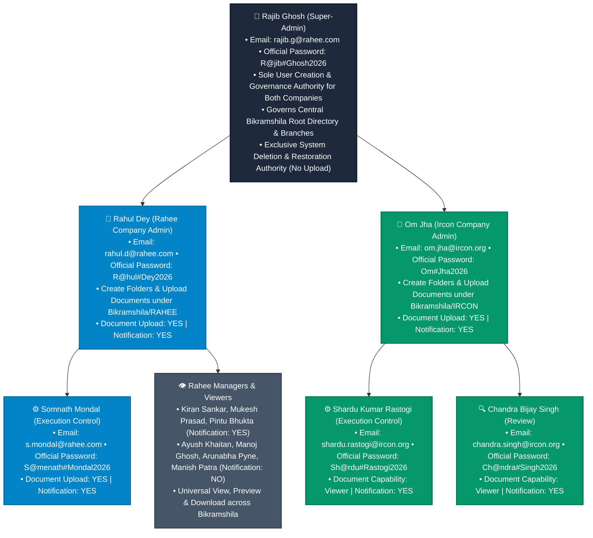

# 📁 Enterprise Document Management System (EDMS) - Master Specification

> **Official Multi-Company Specification & User Governance Directory**  
> Tailored for **Rahee Infratech Limited** (Company 1), **Ircon International Limited** (Company 2), and **Central Bikramshila Infrastructure Governance**.

---

## 📐 1. System Governance & Access Flowchart

---

## 🔑 2. Global Super-Admin Authority & Specifications

| Parameter | Master Technical Specification |
| :--- | :--- |
| **Super Admin Name** | **Rajib Ghosh** |
| **Registered Email** | `rajib.g@rahee.com` |
| **Official Password** | `R@jib#Ghosh2026` |
| **Role & Scope** | **Global Super-Admin** (System-Wide: Rahee Infratech + Ircon International) |
| **User Creation Authority** | **SOLE AUTHORITY:** Super-Admin Rajib Ghosh creates, edits, and manages user accounts for both companies. |
| **Folder Governance** | **Central Bikramshila Root:** Full authority over the **`Bikramshila`** root folder and both company branches (`RAHEE` & `IRCON`). |
| **Document Capability** | **VIEWER / GOVERNANCE:** Rajib Ghosh focuses on User Management, Audit Logs, and Archival/Restoration Governance (No Document Upload). |
| **Deletion Authority** | **EXCLUSIVE AUTHORITY:** File and folder deletion is strictly locked to Super Admin (`Rajib Ghosh` / `Global Admin`). |
| **Document Restoration** | **EXCLUSIVE AUTHORITY:** Super Admin can restore archived files back into the active folder tree (`POST /api/documents/:id/restore`). |

---

## 🏢 3. Rahee Infratech Limited — Official User Specifications

| Name | Email ID | Official Password | Designation | Notification on Upload | Document Capability | Preview & Download | Supported Formats |
| :--- | :--- | :--- | :--- | :---: | :---: | :---: | :--- |
| **Rahul Dey** | `rahul.d@rahee.com` | `R@hul#Dey2026` | **Admin** | **Yes** | 📤 **Upload** | ✅ Preview & Download | Word, PDF, Excel, PPTX, Images, CAD/3D |
| **Somnath Mondal** | `s.mondal@rahee.com` | `S@menath#Mondal2026` | **Execution Control** | **Yes** | 📤 **Upload** | ✅ Preview & Download | Word, PDF, Excel, PPTX, Images, CAD/3D |
| **Kiran Sankar Chowdhury** | `kiransankar.c@rahee.com` | `K1ran#Sankar2026` | **Manager** | **Yes** | 👁️ **Viewer** | ✅ Preview & Download | Word, PDF, Excel, PPTX, Images, CAD/3D |
| **Mukesh Kumar Prasad** | `mukesh.p@rahee.com` | `M@kesh#Prasad2026` | **Manager** | **Yes** | 👁️ **Viewer** | ✅ Preview & Download | Word, PDF, Excel, PPTX, Images, CAD/3D |
| **Pintu Bhukta** | `pintu.b@rahee.com` | `P1ntu#Bhukta2026` | **Manager** | **Yes** | 👁️ **Viewer** | ✅ Preview & Download | Word, PDF, Excel, PPTX, Images, CAD/3D |
| **Ayush Khaitan** | `ayush.k@rahee.com` | `Ayu$h#Khaitan2026` | **Manager** | No | 👁️ **Viewer** | ✅ Preview & Download | Word, PDF, Excel, PPTX, Images, CAD/3D |
| **Manoj Ghosh** | `manoj.g@rahee.com` | `M@noj#Ghosh2026` | **Manager** | No | 👁️ **Viewer** | ✅ Preview & Download | Word, PDF, Excel, PPTX, Images, CAD/3D |
| **Arunabha Pyne** | `arunabha.p@rahee.com` | `Arun#Pyne2026` | **Manager** | No | 👁️ **Viewer** | ✅ Preview & Download | Word, PDF, Excel, PPTX, Images, CAD/3D |
| **Manish Kumar Patra** | `manish.p@rahee.com` | `M@nish#Patra2026` | **Viewer** | No | 👁️ **Viewer** | ✅ Preview & Download | Word, PDF, Excel, PPTX, Images, CAD/3D |

---

## 🏛️ 4. Ircon International Limited — Official User Specifications

| Name | Email ID | Official Password | Designation | Notification on Upload | Document Capability | Preview & Download | Supported Formats |
| :--- | :--- | :--- | :--- | :---: | :---: | :---: | :--- |
| **Om Jha** | `om.jha@ircon.org` | `Om#Jha2026` | **Admin** | **Yes** | 📤 **Upload** | ✅ Preview & Download | Word, PDF, Excel, PPTX, Images, CAD/3D |
| **Shardu Kumar Rastogi** | `shardu.rastogi@ircon.org` | `Sh@rdu#Rastogi2026` | **Execution Control** | **Yes** | 👁️ **Viewer** | ✅ Preview & Download | Word, PDF, Excel, PPTX, Images, CAD/3D |
| **Chandra Bijay Singh** | `chandra.singh@ircon.org` | `Ch@ndra#Singh2026` | **Review** | **Yes** | 👁️ **Viewer** | ✅ Preview & Download | Word, PDF, Excel, PPTX, Images, CAD/3D |

---

## ⚙️ 5. Master Governance Policies & Technical Rules

### A. Universal Cross-Company Access for Both Companies
* Both **Rahee Infratech Limited** and **Ircon International Limited** operate within a single central environment.
* All authenticated users from both companies can search, view, preview, and download documents across both `RAHEE` and `IRCON` branches.

### B. Upload Scopes
* **Rahee Branch (`RAHEE`)**: Uploads permitted exclusively to **Rahul Dey** and **Somnath Mondal**.
* **Ircon Branch (`IRCON`)**: Uploads permitted exclusively to **Om Jha**.
* **Super Admin**: Dedicated to User Governance, Policy Management, and System Audit.

### C. Folder Structure
* **Super Admin View**: Central Root **`Bikramshila`** with company branches **`RAHEE`** and **`IRCON`**.
* **Company Users View**: Direct root starts at **`RAHEE`** (for Rahee users) and **`IRCON`** (for Ircon users).

### D. Single-Tier Static Tagging (`General Version V1`)
* Every uploaded file is tagged with **`General Version V1`** for instant repository availability.

### E. Exclusive Super-Admin Deletion Safeguard
* Regular users and Company Admins are strictly blocked from deleting files (`HTTP 403 Forbidden`). Deletion is exclusive to Super Admin.
