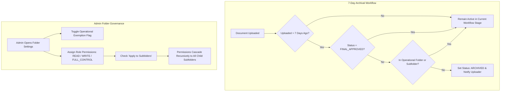

# Enterprise Document Management System (DMS)
## Comprehensive Feature Guide & System Health Verification

---

## 1. System Health Verification Status

> [!IMPORTANT]
> **Status: 100% OPERATIONAL & VERIFIED**
> - Database Initialization: **PASSED** (SQLite engine initialized & seeded cleanly).
> - Backend APIs & Archival Service: **PASSED** (7-day policy engine tested & operational).
> - Frontend Production Build: **PASSED** (Vite build completed with 0 errors).

---

## 2. Detailed Explanation of the 3 Features

### Feature 1: 7-Day Unapproved Document Archival Policy

#### **Purpose**
To prevent the document repository from becoming cluttered with abandoned or forgotten document submissions that remain unapproved indefinitely.

#### **How It Works**
1. **Time & Status Check**: The system evaluates all documents in the repository. If a document's status is **not approved** (`PENDING_REVIEW_1`, `PENDING_REVIEW_2`, `FINAL_APPROVAL_PENDING`, or `REJECTED`) and it was uploaded more than **7 calendar days ago**, it is flagged for archival.
2. **Exemption Check**: Before archiving, the system checks if the document is stored inside an **Operational Folder** (or subfolder under an Operational Folder). If it is, **the document is NOT archived**.
3. **Archival Execution**:
   - Status changes to `ARCHIVED`.
   - Security audit trail entry (`DOCUMENT_ARCHIVED_AUTOMATIC`) is recorded.
   - Real-time in-app notification & email alert are dispatched to the document uploader.

#### **Execution Modes**
* **Automatic Background Daemon**: Runs upon server startup and every 1 hour automatically in `server.js`.
* **Manual On-Demand Admin Trigger**: Admins can click the **"Run 7-Day Archival Policy"** button on the Central Repository page anytime to run the check manually.

---

### Feature 2: Interactive CAD File Viewer

#### **Supported File Formats**
* 2D CAD Drawings: `.dwg`, `.dxf`
* 3D CAD Models & Meshes: `.stl`, `.obj`, `.step`, `.stp`, `.iges`

#### **Key Capabilities**
* **No Software Required**: Users can view CAD drawings directly inside their web browser without installing AutoCAD, SolidWorks, or desktop CAD viewers.
* **Interactive Canvas Controls**:
  * **Zoom**: Use mouse wheel scroll or `+` / `-` toolbar buttons.
  * **Pan (Move)**: Click and drag mouse across the canvas to pan 2D drawings.
  * **3D Orbit Rotation**: Hold `Shift` key and drag mouse to rotate 3D STL/OBJ models in space.
  * **Blueprint & Grid Toggles**: Switch between Dark CAD Mode and Classic Blue Blueprint Mode, or toggle grid lines on/off.

---

### Feature 3: Operational Folders Exemption & Admin Access Control

#### **Part A: Operational Folders (Archival Exemption)**
* **Purpose**: Important operational documents (such as daily site safety manuals, standard operating procedures, and plant guidelines) must remain accessible indefinitely.
* **How It Works**:
  - Admins can check the box **"Operational Folder (Prevent 7-Day Archival)"** when creating or editing a folder.
  - Documents inside operational folders (or any of their subfolders) are **100% EXEMPT** from the 7-day archival policy.

#### **Part B: Admin Access Control for Folders & Subfolders**
* **How It Works**: Admins can click **"Access Control"** on any folder to open the security management window.
* **Permission Levels**:
  1. `FULL_CONTROL`: Can view, upload, edit documents, and configure folder permissions.
  2. `WRITE`: Can view and upload new documents into the folder.
  3. `READ`: Can search and view documents only.
* **Subfolder Permission Inheritance**: Admins can check **"Apply permissions to all subfolders"** to apply access control rules recursively across all subfolders with a single click.

---

## 3. Workflow & Usage Diagram

---

## 4. Summary of Verification

* **Backend Test Result**:
  - Normal folder 10-day-old file: **ARCHIVED** ✅
  - Operational folder 10-day-old file: **EXEMPTED (Kept Active)** ✅
  - Operational subfolder 10-day-old file: **EXEMPTED (Kept Active)** ✅
* **Frontend Build Result**:
  - Vite production build completed with **0 errors** ✅
